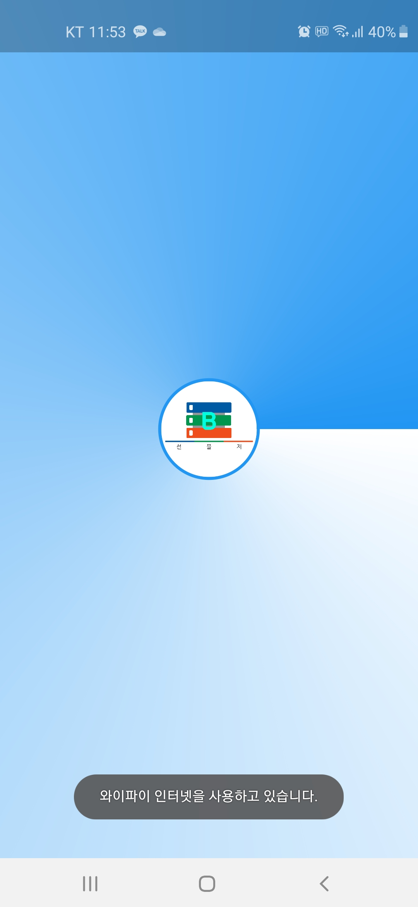
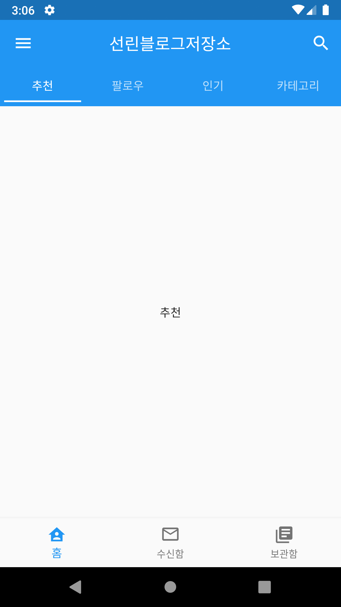

# sunblosave
안드로이드에서만 실행이 되는 블로그 만들고 공유하고 볼수있는 앱.

[깃허브링크](https://github.com/Lansional/sunblosave)

## 현재버전
```
0.1 alpha 1
```

## 진행버전
```
0.2 alpha 1
```

## 완성
```
1. 틀
2. 서버연동
3. 시작 페이지
4. 테마 바꾸기 (Dark Mode)
5. 구글 연동 (sync firebase)
6. 다른 사람이 만든 블로그 보기
```

## 지금 발견한 버그
```
1. 메인 페이지에서 주제 chip 버그
...
```

## TODO
```
1. Notification 사용 (firebase_messaging)
2. 바로가기 사용 (quick_actions)
3. 계정연동
    1) 구글계정 (아이디와 비밀번호 입력)
    2) 깃허브계정 (API사용)
4. 시작페이지 (Tabbar)
    1) 추천 (보는 사람들이 제일 많은 수로 정렬)
    2) 카테고리 
    3) 팔로우 (팔로우한 유저중에서 올린 데로)
    4) 인기 (따봉 수로 정렬)
5. 사용자페이지 (Drawer)
6. 설정페이지 (사용자페이지에 있음)
    1) 테마변경 (검은색 테마)
```

## 완성한 TODO
```
1.Bottomnavigatorbar		(done)
    1) 시작페이지 (home page)
    2) 보관함페이지
    3) 수신함페이지
```

### 페이지

